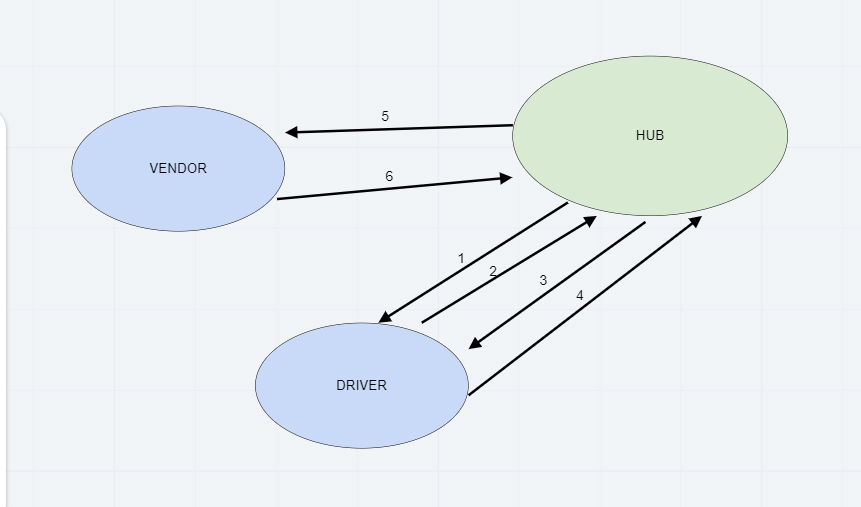

# caps
## The Setup
1. Initialize your app -- `npm init -y`
1. Install your dependencies -- `npm i dotconfig express jest`
1. Create the files and folders required for the application
1. Create the correct content in the files
1. Test your server -- `npm test`
   - You should see 100% of tests passing

### Github

1. Create a new repository at GitHub, called `server-deployment-practice`
   - Select the "Add a README" option
   - Select the "Add a .gitignore" option, and choose Node.js
   - Opt for the MIT license
1. Clone this to your local machine.
1. Immediately create a "dev" branch to do your work in
   `git checkout -b dev`

## Document your work

1. Open up the README.md file in your editor. It should contain the notes your instructor provided during their demo
1. Change the URLs to point to your Heroku applications, your Github actions, and your pull request
1. Add your drawings and notes
1. ACP this to main

## Scope
Build a set of applications to manage deliveries made by CAPS Drivers. This will simulate a delivery driver delivering a package and scanning the package code. Retailers will be able to see in their dashboard or log, a list of all packages delivered in real time. Should a delivery driver deliver many packages while the retailer is not connected to the dashboard, the retailer should be able to “catch up” and see a list of all missed events before resuming real-time monitoring.

* Here are the high level stories related to this new set of requirements

* As a vendor, I want to “subscribe” to “delivered” notifications so that I know when my packages are delivered
* As a vendor, I want to “catch up” on any “delivered” notifications that I might have missed so that I can see a complete log
* As a driver, I want to “subscribe” to “pickup” notifications so that I know what packages to deliver
* As a driver, I want to “catch up” on any “pickup” notifications I may have missed so that I can deliver everything
* As a driver, I want a way to “scan” a delivery so that the vendors know when a package has been delivered
* And as developers, here are some of the development stories that are newly relevant to the above

* As a developer, I want to create a system of tracking who is subscribing to each event
* As a developer, I want to place all inbound messages into a “queue” so that my application knows what events are to be delivered
* As a developer, I want to create a system for communicating when events have been delivered and received by subscribers
* As a developer, I want to delete messages from the queue after they’ve been received by a subscriber, so that I don’t re-send them
* As a developer, I want to create a system for allowing subscribers to retrieve all undelivered messages in their queue

 
### UML

 

### Collaborators
* Jason Quaglia
* Carly Dekock
* Nick Magruder
* Seid
