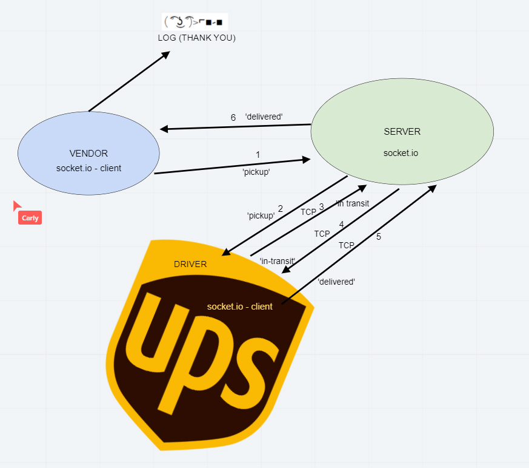

# caps
## The Setup
1. Initialize your app -- `npm init -y`
1. Install your dependencies -- `npm i dotconfig express jest`
1. Create the files and folders required for the application
1. Create the correct content in the files
1. Test your server -- `npm test`
   - You should see 100% of tests passing

### Github

1. Create a new repository at GitHub, called `server-deployment-practice`
   - Select the "Add a README" option
   - Select the "Add a .gitignore" option, and choose Node.js
   - Opt for the MIT license
1. Clone this to your local machine.
1. Immediately create a "dev" branch to do your work in
   `git checkout -b dev`

## Document your work

1. Open up the README.md file in your editor. It should contain the notes your instructor provided during their demo
1. Change the URLs to point to your Heroku applications, your Github actions, and your pull request
1. Add your drawings and notes
1. ACP this to main

## Scope
* The following user/developer stories detail the major functionality for this phase of the project.

* As a vendor, I want to alert the system when I have a package to be picked up
* As a driver, I want to be notified when there is a package to be delivered
* As a driver, I want to alert the system when I have picked up a package and it is in transit
* As a driver, I want to alert the system when a package has been delivered
* As a vendor, I want to be notified when my package has been delivered
* And as developers, here are some of the development stories that are relevant to the above

* As a developer, I want to use industry standards for managing the state of each package
* As a developer, I want to create an event driven system so that I can write code that happens in response to events, in real time

 
### UML

 

### Collaborators
* Jason Quaglia
* Carly Dekock
* Nick Magruder
* Seid
